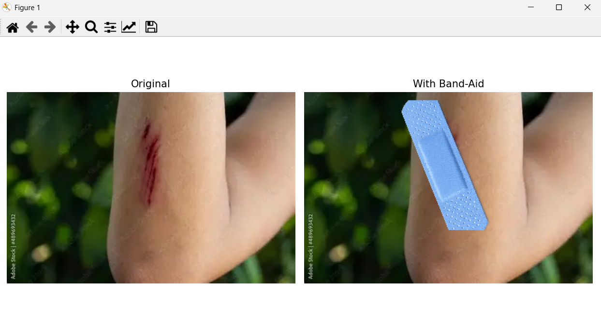

# opencv-wound-detection-bandaid
Automatic wound detection using OpenCV that identifies skin injuries and intelligently places a band-aid overlay using computer vision techniques.
This project uses **Computer Vision with OpenCV** to automatically detect a **wound on skin** and place a **Band-Aid overlay** on the detected area.

The system performs the following steps:

1. Detects wound using **HSV red color segmentation**
2. Finds the **largest wound contour**
3. Calculates **position, size, and orientation**
4. Places a **transparent Band-Aid image**
5. Rotates and resizes it automatically

This project demonstrates practical knowledge of:

- Computer Vision
- Image Processing
- Contour Detection
- Image Overlay with Transparency
- Image Transformation

---

# 🖼 Project Demo

### Input → Output

Left: Original arm image  
Right: Band-Aid automatically placed on wound

---
# 🚀 Features
✔ Automatic wound detection  
✔ HSV color segmentation  
✔ Morphological noise removal  
✔ Contour detection  
✔ Dynamic band-aid resizing  
✔ Rotation matching wound orientation  
✔ Transparent alpha overlay  
✔ Original vs result visualization  

---

# 🧠 Algorithm Pipeline
Input Image
↓
Convert RGB → HSV
↓
Red Color Segmentation
↓
Morphological Noise Removal
↓
Contour Detection
↓
Find Largest Wound Region
↓
Compute Position & Rotation
↓
Resize + Rotate Band-Aid
↓
Overlay Using Alpha Channel
↓
Final Output

# 📂 Project Structure
wound-detection-opencv
│
├── wound_detection.py
├── arm.webp
├── bandaid.png
│
├── images
│ ├── project-banner.png
│ ├── original.png
│ ├── result.png
│ └── demo.gif
│
└── README.md

